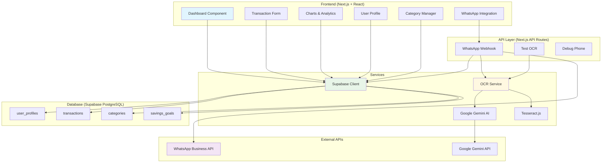
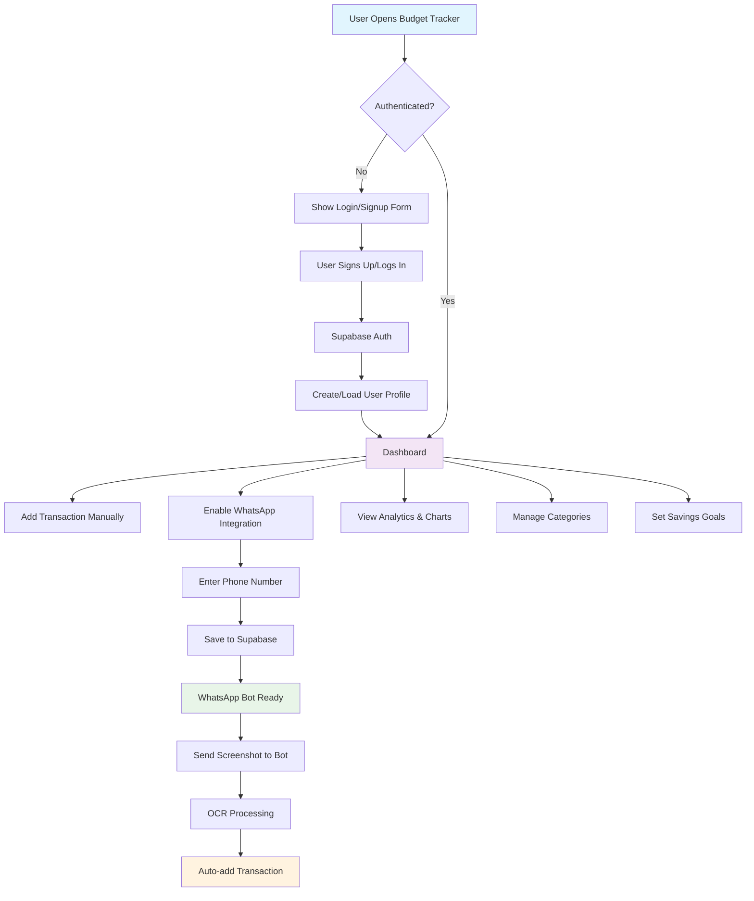
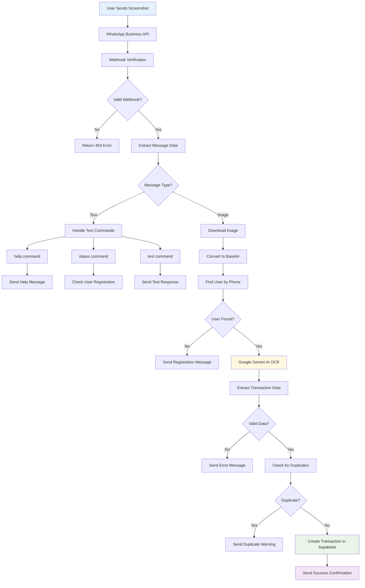
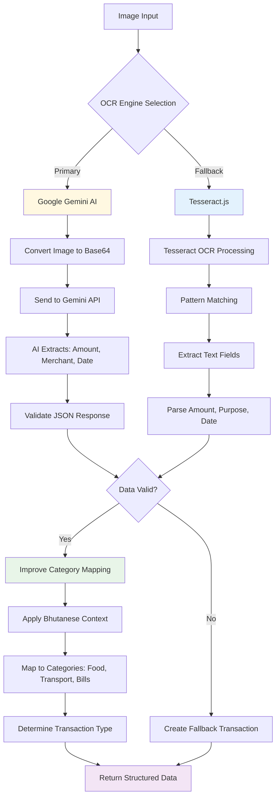

# 🎯 Interactive Budget & Expense Tracker with AI-Powered WhatsApp Integration

A comprehensive web-based budget and expense tracker built with Next.js, Supabase, and AI-powered OCR. Track your finances effortlessly by simply sending transaction screenshots via WhatsApp, or manage them manually with a rich web interface.

## ✨ Key Features

### 🤖 **AI-Powered WhatsApp Automation**
- **Smart OCR**: Send transaction screenshots to WhatsApp bot for automatic processing
- **Google Gemini AI**: Advanced text extraction with 95%+ accuracy for transaction data
- **Tesseract.js Fallback**: Local OCR processing for privacy and reliability
- **Bhutanese Banking Support**: Optimized for local banking formats and languages
- **Duplicate Detection**: Intelligent duplicate transaction prevention
- **Real-time Notifications**: Instant confirmation and error messages

### 💰 **Comprehensive Financial Management**
- 🔐 **Secure Authentication** - Multi-factor auth with Supabase
- 💸 **Smart Transaction Management** - Add, edit, delete with categorization
- 📊 **Advanced Analytics** - Interactive charts and spending insights
- 🎯 **Savings Goals** - Set and track monthly targets with progress visualization
- 📱 **Progressive Web App** - Install as native app on any device
- 🌙 **Dark/Light Themes** - Customizable interface preferences
- 📂 **Dynamic Categories** - Drag-and-drop category management
- 📅 **Time-based Filtering** - Analyze spending patterns over time

### 🔧 **Technical Excellence**
- **Modern Tech Stack**: Next.js 14, TypeScript, Tailwind CSS
- **Real-time Database**: Supabase with Row-Level Security
- **Responsive Design**: Mobile-first approach with PWA capabilities
- **Performance Optimized**: Service worker caching and lazy loading
- **Scalable Architecture**: Microservices-ready API design

## 🏗️ System Architecture



## 🚀 User Flow

### Main Application Flow


### WhatsApp Integration Workflow


## 🧠 AI OCR Processing Pipeline



## 🔧 Tech Stack

### **Frontend**
- **Framework**: Next.js 14 with App Router
- **Language**: TypeScript for type safety
- **UI Library**: React 18 with Hooks
- **Styling**: Tailwind CSS with custom design system
- **Icons**: Lucide React for consistent iconography
- **Charts**: Recharts for interactive data visualization
- **PWA**: next-pwa for offline capabilities

### **Backend & Database**
- **Backend**: Next.js API Routes (serverless)
- **Database**: Supabase (PostgreSQL) with real-time subscriptions
- **Authentication**: Supabase Auth with Row-Level Security
- **File Storage**: Supabase Storage (for future avatar uploads)

### **AI & OCR Services**
- **Primary OCR**: Google Gemini AI (Gemini-2.5-flash model)
- **Fallback OCR**: Tesseract.js for local processing
- **Image Processing**: Canvas API and Buffer for base64 conversion
- **Smart Categorization**: Custom ML-like categorization rules

### **External Integrations**
- **WhatsApp**: WhatsApp Business API
- **Deployment**: Vercel with automatic deployments
- **CDN**: Vercel Edge Network for global performance

### **Development Tools**
- **Package Manager**: npm
- **Linting**: ESLint with Next.js configuration
- **Type Checking**: TypeScript compiler
- **CSS Processing**: PostCSS with Tailwind

## 🚀 Quick Start Guide

### Prerequisites
- Node.js 18+ and npm
- Supabase account
- Google Cloud account (for Gemini AI)
- WhatsApp Business account (optional)

### 1. Clone and Install
```bash
git clone https://github.com/yourusername/budget-tracker-app.git
cd budget-tracker-app
npm install
```

### 2. Environment Setup
Create `.env.local` with the following variables:

```env
# Supabase Configuration
NEXT_PUBLIC_SUPABASE_URL=your_supabase_project_url
NEXT_PUBLIC_SUPABASE_ANON_KEY=your_supabase_anon_key

# AI OCR Configuration
GEMINI_API_KEY=your_google_gemini_api_key

# WhatsApp Business API (Optional)
WHATSAPP_ACCESS_TOKEN=your_whatsapp_access_token
WHATSAPP_PHONE_NUMBER_ID=your_phone_number_id
WHATSAPP_VERIFY_TOKEN=your_webhook_verify_token
NEXT_PUBLIC_WHATSAPP_BOT_NUMBER=your_bot_phone_number
```

### 3. Database Setup
Run the SQL commands from `supabase-schema.sql` in your Supabase SQL editor:

```sql
-- User profiles with WhatsApp integration
CREATE TABLE user_profiles (
  id UUID DEFAULT gen_random_uuid() PRIMARY KEY,
  user_id UUID REFERENCES auth.users(id) ON DELETE CASCADE NOT NULL UNIQUE,
  username TEXT NOT NULL UNIQUE,
  full_name TEXT,
  avatar_url TEXT,
  phone_number TEXT UNIQUE,
  whatsapp_enabled BOOLEAN DEFAULT false,
  created_at TIMESTAMP WITH TIME ZONE DEFAULT NOW(),
  updated_at TIMESTAMP WITH TIME ZONE DEFAULT NOW()
);

-- Enhanced transactions table with source tracking
CREATE TABLE transactions (
  id UUID DEFAULT gen_random_uuid() PRIMARY KEY,
  user_id UUID REFERENCES auth.users(id) ON DELETE CASCADE NOT NULL,
  amount DECIMAL(10,2) NOT NULL,
  category TEXT NOT NULL,
  type TEXT CHECK (type IN ('income', 'expense')) NOT NULL,
  date DATE NOT NULL,
  notes TEXT,
  source TEXT DEFAULT 'manual' CHECK (source IN ('manual', 'whatsapp', 'api')),
  merchant TEXT,
  created_at TIMESTAMP WITH TIME ZONE DEFAULT NOW()
);

-- Categories and savings goals tables...
-- (See supabase-schema.sql for complete setup)
```

### 4. WhatsApp Setup (Optional)
1. **Get WhatsApp Business API Access**:
   - Apply for WhatsApp Business API
   - Get access token and phone number ID
   - Set up webhook URL: `https://yourapp.vercel.app/api/whatsapp/webhook`

2. **Configure Webhook**:
   - Use a secure verify token (32+ characters)
   - Add the same token to your environment variables
   - Subscribe to `messages` webhook events

### 5. Google Gemini Setup
1. **Create Google Cloud Project**:
   - Enable Gemini API
   - Create API key
   - Add to environment variables

2. **Configure OCR Settings**:
   - The app automatically falls back to Tesseract.js if Gemini fails
   - Adjust OCR settings in `lib/ocr-service.ts`

### 6. Development
```bash
npm run dev
```

Open [http://localhost:3000](http://localhost:3000)

### 7. Production Deployment
1. **Deploy to Vercel**:
   ```bash
   # Connect to Vercel
   npx vercel login
   npx vercel --prod
   ```

2. **Add Environment Variables** in Vercel dashboard

3. **Update WhatsApp Webhook URL** to your Vercel domain

## 📱 How to Use WhatsApp Integration

### For Users

#### **Setup (One-time)**
1. Open the Budget Tracker app
2. Go to Profile Settings → WhatsApp Integration
3. Enter your phone number (e.g., `+975 17123456` or `17123456`)
4. Click "Enable WhatsApp"
5. Save the bot number: `+15551847923` (example)

#### **Daily Usage**
1. **Take Screenshot**: When you make a purchase, screenshot the transaction confirmation
2. **Send to Bot**: Open WhatsApp and send the screenshot to the bot
3. **Get Confirmation**: Receive instant confirmation with extracted transaction details
4. **Check App**: View the automatically added transaction in your budget tracker

#### **Supported Commands**
- Send screenshot → Auto-add transaction
- `help` → Show available commands
- `status` → Check your registration status
- `test` → Test bot connectivity

### For Developers

#### **Webhook Verification Process**
1. WhatsApp sends GET request with verification parameters
2. App validates `hub.verify_token` against environment variable
3. Returns `hub.challenge` if verification succeeds

#### **Message Processing Pipeline**
1. **Authentication**: Verify webhook signature
2. **User Lookup**: Find user by phone number with flexible matching
3. **Image Download**: Retrieve image from WhatsApp Media API
4. **OCR Processing**: Extract transaction data using AI
5. **Validation**: Check for duplicates and data quality
6. **Database Storage**: Save transaction with proper categorization
7. **Confirmation**: Send success/error message to user

#### **Phone Number Matching Logic**
The system handles various phone number formats:
- **Bhutan Local**: `17123456` → `+975 17123456`
- **Bhutan Full**: `97517123456` → `+975 17123456`
- **International**: `+1234567890` → stored as-is
- **Flexible Matching**: Finds users regardless of format differences

## 🧪 Testing OCR Functionality

### Manual Testing
1. Visit `/test-ocr` in your app
2. Upload a transaction screenshot
3. View extracted data and accuracy
4. Test with various banking formats

### WhatsApp Testing
1. Use the test webhook script:
   ```bash
   node test-webhook.js
   ```
2. Send test images to your WhatsApp bot
3. Monitor webhook logs in Vercel dashboard

## 🔒 Security Features

### **Authentication & Authorization**
- **Supabase Auth**: Email/password with optional social login
- **Row-Level Security**: Users can only access their own data
- **JWT Tokens**: Secure API authentication
- **Phone Number Verification**: Prevents unauthorized WhatsApp access

### **Data Privacy**
- **Local OCR Option**: Tesseract.js processes images locally
- **Secure Webhooks**: Signature verification for WhatsApp
- **Encrypted Storage**: All data encrypted at rest in Supabase
- **GDPR Compliant**: Data deletion and export capabilities

### **API Security**
- **Environment Variables**: Sensitive keys stored securely
- **Rate Limiting**: Prevents API abuse (implement as needed)
- **Input Validation**: All inputs sanitized and validated
- **Error Handling**: No sensitive data in error messages

## 📊 Database Schema

### **Core Tables**
- **`user_profiles`**: User information and WhatsApp settings
- **`transactions`**: All financial transactions with source tracking
- **`categories`**: User-defined transaction categories
- **`savings_goals`**: Monthly savings targets

### **Key Features**
- **Cascade Deletes**: Clean up when users delete accounts
- **Flexible Categories**: Users can create custom categories
- **Source Tracking**: Know which transactions came from WhatsApp
- **Optimized Indexing**: Fast queries for large datasets

## 🎨 PWA Features

### **Installation**
- **Mobile**: Add to Home Screen from browser
- **Desktop**: Install button in address bar
- **Offline Support**: Service worker caching
- **App-like Experience**: Standalone window mode

### **Performance**
- **Fast Loading**: Critical resources cached
- **Background Sync**: Sync data when connection restored
- **Push Notifications**: Ready for future implementation
- **Responsive Icons**: Adaptive icons for all platforms

## 🤝 Contributing

1. **Fork the repository**
2. **Create feature branch**: `git checkout -b feature/amazing-feature`
3. **Commit changes**: `git commit -m 'Add amazing feature'`
4. **Push to branch**: `git push origin feature/amazing-feature`
5. **Open Pull Request**

### **Development Guidelines**
- Follow TypeScript best practices
- Write comprehensive tests
- Update documentation
- Ensure mobile responsiveness
- Test WhatsApp integration thoroughly


## 🐛 Troubleshooting

### **Common Issues**

#### **WhatsApp Bot Not Responding**
1. Check webhook URL is accessible and uses HTTPS
2. Verify `WHATSAPP_VERIFY_TOKEN` matches Meta dashboard
3. Ensure phone number is registered correctly
4. Check Vercel function logs for errors

#### **OCR Extraction Errors**
1. Ensure image quality is good (clear text, good lighting)
2. Check if Gemini API key is valid and has quota
3. Test with Tesseract.js fallback
4. Verify supported image formats (JPEG, PNG)

#### **User Registration Issues**
1. Verify phone number format matches database
2. Check if WhatsApp is enabled in user profile
3. Ensure Supabase RLS policies are correct
4. Test with various phone number formats

#### **Database Connection Problems**
1. Verify Supabase URL and API key
2. Check if RLS policies allow access
3. Ensure database tables exist
4. Test with Supabase SQL editor

### **Debug Tools**
- **Debug Phone**: `/api/debug-phone` endpoint for phone number testing
- **Test OCR**: `/test-ocr` page for manual OCR testing
- **Webhook Logs**: Vercel dashboard function logs
- **Browser DevTools**: Network tab for API calls

## 📄 License

MIT License - feel free to use this project for personal or commercial purposes.

---

**Built with ❤️ for modern financial management in Bhutan and beyond.**

For support, questions, or feature requests, please open an issue on GitHub or contact the development team.
